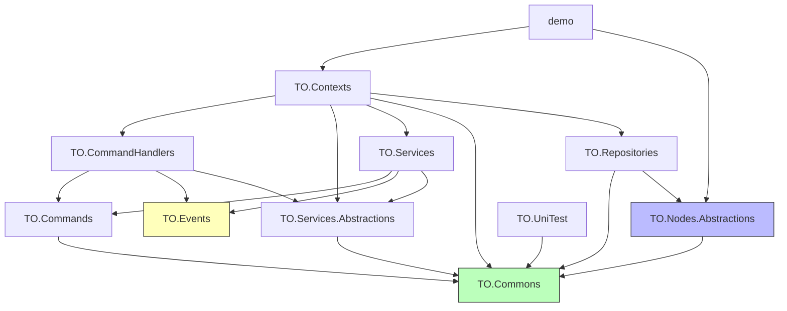

--- 


# 📚 Demo 项目依赖开发文档

## 🧩 一、项目概述

Demo 是一个基于 Godot 引擎（4.4.1）构建的游戏项目，采用模块化架构设计，使用 `.NET 9` 开发。项目中各子项目通过清晰的分层和引用关系实现松耦合，便于维护与扩展。

--- 


## 🏗️ 二、项目结构概览

项目名称 | SDK 类型 | 目标框架 | 作用
:----------- | :----------- | :----------- | :-----------
[demo.csproj](file://d:\GodotProjects\demo\demo.csproj) | `Godot.NET.Sdk/4.4.1` | `net9.0` | 主游戏项目，负责整合所有模块
[TO.Contexts.csproj](file://d:\GodotProjects\demo\TO.Contexts\TO.Contexts.csproj) | `Godot.NET.Sdk/4.4.1` | `net9.0` | 上下文管理核心模块，协调多个服务之间的交互
[TO.CommandHandlers.csproj](file://d:\GodotProjects\demo\TO.CommandHandlers\TO.CommandHandlers.csproj) | `Godot.NET.Sdk/4.4.1` | `net9.0` | 命令处理器实现
[TO.Commands.csproj](file://d:\GodotProjects\demo\TO.Commands\TO.Commands.csproj) | `Microsoft.NET.Sdk` | `net9.0` | 命令定义
[TO.Services.csproj](file://d:\GodotProjects\demo\TO.Services\TO.Services.csproj) | `Microsoft.NET.Sdk` | `net9.0` | 应用服务实现模块
[TO.Services.Abstractions.csproj](file://d:\GodotProjects\demo\TO.Services.Abstractions\TO.Services.Abstractions.csproj) | `Microsoft.NET.Sdk` | `net9.0` | 应用服务接口定义
[TO.Events.csproj](file://d:\GodotProjects\demo\TO.Events\TO.Events.csproj) | `Microsoft.NET.Sdk` | `net9.0` | 事件系统
[TO.Repositories.csproj](file://d:\GodotProjects\demo\TO.Repositories\TO.Repositories.csproj) | `Microsoft.NET.Sdk` | `net9.0` | 仓储实现模块
[TO.Repositories.Abstractions.csproj](file://d:\GodotProjects\demo\TO.Repositories.Abstractions\TO.Repositories.Abstractions.csproj) | `Microsoft.NET.Sdk` | `net9.0` | 仓储接口定义
[TO.Data.csproj](file://d:\GodotProjects\demo\TO.Data\TO.Data.csproj) | `Microsoft.NET.Sdk` | `net9.0` | 数据模型和序列化
[TO.Nodes.Abstractions.csproj](file://d:\GodotProjects\demo\TO.Nodes.Abstractions\TO.Nodes.Abstractions.csproj) | `Microsoft.NET.Sdk` | `net9.0` | 节点系统抽象定义
[TO.Commons.csproj](file://d:\GodotProjects\demo\TO.Commons\TO.Commons.csproj) | `Godot.NET.Sdk/4.4.1` | `net9.0` | 公共工具类、共享模型、基础类型
[TO.UniTest.csproj](file://d:\GodotProjects\demo\TO.UniTest\TO.UniTest.csproj) | `Microsoft.NET.Sdk` | `net8.0` | 单元测试项目


--- 


## 🔗 三、依赖关系图（仅保留项目间引用）




--- 


## 📦 四、项目层级划分与职责说明

### 1. 最底层通用项目（Infrastructure Layer）

#### ✅ `TO.Commons`


- **职责**：存放通用工具类、基础模型、常量、扩展方法等。
- **被依赖情况**：几乎所有项目都依赖于它。
- **依赖**：仅依赖 Newtonsoft.Json 包。

#### ✅ `TO.Events`


- **职责**：事件系统定义。
- **依赖**：`TO.Commons`

#### ✅ `TO.Nodes.Abstractions`


- **职责**：定义节点系统的抽象接口。
- **依赖**：`TO.Commons`

--- 


### 2. 抽象接口层（Abstractions Layer）

#### ✅ `TO.Services.Abstractions`


- **职责**：定义应用服务接口，供具体实现项目引用。
- **依赖**：`TO.Commons`

#### ✅ `TO.Repositories.Abstractions`


- **职责**：定义仓储接口，供具体实现项目引用。
- **依赖**：`TO.Commons`

--- 


### 3. 数据模型层（Data Model Layer）

#### ✅ `TO.Data`


- **职责**：定义数据模型和序列化。
- **依赖**：`TO.Commons`

--- 


### 4. 应用层（Application Layer）

#### ✅ `TO.Commands`


- **职责**：定义命令。
- **依赖**：`TO.Commons`

#### ✅ `TO.Services`


- **职责**：实现应用服务逻辑。
- **依赖**：

    - `TO.Commands`
    - `TO.Events`
    - `TO.Services.Abstractions`

#### ✅ `TO.CommandHandlers`


- **职责**：实现命令处理器。
- **依赖**：

    - `TO.Commands`
    - `TO.Events`
    - `TO.Services.Abstractions`

--- 


### 5. 实现层（Implementation Layer）

#### ✅ `TO.Repositories`


- **职责**：仓储实现模块（如数据访问、持久化等）。
- **依赖**：

    - `TO.Commons`
    - `TO.Nodes.Abstractions`

#### ✅ `TO.Contexts`


- **职责**：上下文管理核心模块，协调多个服务之间的交互。
- **依赖**：

    - `TO.CommandHandlers`
    - `TO.Services.Abstractions`
    - `TO.Services`
    - `TO.Commons`
    - `TO.Repositories`

--- 


### 6. 主入口项目（Main Entry Project）

#### ✅ `demo`


- **职责**：主游戏项目，负责整合所有模块。
- **依赖**：

    - `TO.Contexts`
    - `TO.Nodes.Abstractions`
    - `TO.Services`
- **NuGet包**: Autofac

--- 


## 🧪 七、单元测试项目

#### ✅ `TO.UniTest`


- **职责**：单元测试项目。
- **目标框架**: .NET 8.0（与其他项目不一致）
- **依赖**：

    - `TO.Commons`
    - `TO.Domains.Services`（项目不存在）
- **NuGet包**: Autofac
- **注意**: 该项目未包含在解决方案文件中

--- 


## 📝 八、开发建议

### 1. 分层开发原则


- 所有项目应遵循"上层依赖下层"的原则，确保依赖方向统一向下。
- 修改通用项目时需谨慎，影响范围较大。
- 抽象层项目应保持稳定，避免频繁修改接口。

### 2. 模块化开发


- 各功能模块可独立开发、测试、部署。
- 可通过 `TO.Contexts` 进行集中注册和管理。
- 使用依赖注入容器（Autofac）管理对象生命周期。

### 3. 推荐开发顺序


1. **基础层**：`TO.Commons` → `TO.Events` → `TO.GodotNodes.Abstractions`
2. **抽象层**：`TO.Nodes.Abstractions` → `TO.Infras.Writers.Abstractions` → `TO.Apps.Services.Abstractions`
3. **领域模型层**：`TO.Domains.Models.VO` → `TO.Domains.Models.AggregateRoots.Abstractions` → `TO.Domains.Models.AggregateRoots`
4. **领域层**：`TO.Domains.Models.Repositories.Abstractions` → `TO.Domains.Eevents` → `TO.Domains.Models.Entities`
5. **基础设施层**：`TO.Infras.Writers` → `TO.Infras.Repositories`
6. **应用层**：`TO.Apps.Commands` → `TO.Apps.Events` → `TO.Domains.Services.Abstractions` → `TO.Domains.Services`
7. **服务层**：`TO.Apps.Services` → `TO.Apps.CommandHandles`
8. **集成层**：`TO.Contexts`
9. **主项目**：`demo`
10. **测试项目**：`TO.UniTest`

### 4. 技术栈说明

#### 核心框架
- **.NET 9.0**: 现代化的 .NET 平台，提供高性能和跨平台支持（除TO.UniTest使用.NET 8.0）
- **Godot 4.4.1**: 开源游戏引擎，支持 C# 开发

#### 依赖注入
- **Autofac**: 强大的 IoC 容器，支持复杂的依赖关系管理
  - 使用项目：demo, TO.Contexts, TO.CommandHandlers, TO.UniTest

#### 命令查询职责分离 (CQRS)
- **MediatR**: 实现 CQRS 模式的轻量级库
  - 使用项目：TO.Contexts, TO.CommandHandlers
- **MediatR.Extensions.Autofac.DependencyInjection**: MediatR 与 Autofac 的集成
  - 使用项目：TO.Contexts

#### 数据处理
- **Newtonsoft.Json**: JSON 序列化和反序列化
  - 使用项目：TO.Commons

---

## 📋 六、建议目录结构

```
demo/
├── TO.Commons/                     # 通用库
├── TO.Events/                      # 事件系统
├── TO.Nodes.Abstractions/          # 节点系统抽象
├── TO.Services.Abstractions/       # 应用服务接口
├── TO.Repositories.Abstractions/   # 仓储接口
├── TO.Data/                        # 数据模型和序列化
├── TO.Commands/                    # 命令定义
├── TO.Services/                    # 应用服务实现
├── TO.CommandHandlers/             # 命令处理器
├── TO.Repositories/                # 仓储实现
├── TO.Contexts/                    # 上下文管理
├── demo/                           # 主游戏项目
└── TO.UniTest/                     # 单元测试

```

---

## ⚠️ 七、已知问题和改进建议

### 项目配置问题
1. **TO.UniTest项目未包含在解决方案中**
   - 问题：TO.UniTest项目存在但未在demo.sln中定义
   - 建议：将TO.UniTest项目添加到解决方案文件中

2. **.NET版本不一致**
   - 问题：TO.UniTest使用.NET 8.0，其他项目使用.NET 9.0
   - 建议：统一所有项目使用.NET 9.0

3. **依赖引用错误**
   - 问题：TO.Contexts引用了不存在的TO.Apps.Services相关项目
   - 问题：TO.UniTest引用了不存在的TO.Domains.Services项目
   - 建议：修正项目引用，确保引用的项目实际存在

### 架构改进建议
1. **简化项目结构**
   - 当前项目结构相比原设计已经简化，更符合实际需求
   - 建议继续保持简洁的项目结构，避免过度设计

2. **完善单元测试**
   - 建议修正TO.UniTest的依赖关系
   - 为核心业务逻辑添加更多测试覆盖

--- 


## 📋 十、总结

本文档详细描述了 Demo 项目的依赖关系和架构设计。项目采用了清晰的分层架构，通过依赖注入和中介者模式实现了松耦合的设计。各个模块职责明确，便于维护和扩展。

在开发过程中，建议严格按照依赖方向进行开发，确保架构的稳定性和可维护性。
